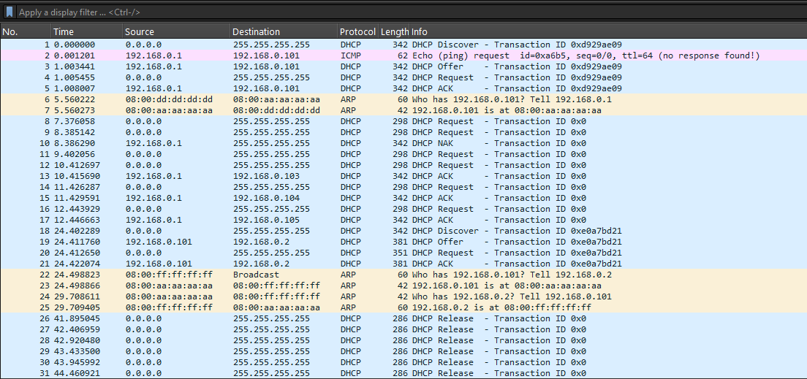
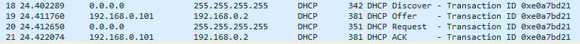

# DHCP_Rogue_Server_Kelompok-7

| Nama | NRP |
|:--|:-:|
| Sultan Ahmad Maulana Bahyshidqi | 5027251070|
| I Made Gyanendra Anand Wisnawa | 5027251072 |
| Muhammad Rifki Pribadi | 5027251087 |

## Pendahuluan

DHCP Rogue Server (Server DHCP Liar/Palsu) merupakan sebuah server DHCP tidak sah yang berjalan di dalam suatu infrastruktur jaringan komputer tanpa izin maupun sepengetahuan administrator jaringan. Kehadiran server liar ini bisa terjadi akibat kesengajaan dari pihak penyerang (attacker) yang ingin menyusup, atau akibat kelalaian pengguna yang tanpa sadar menghubungkan perangkat router tambahan ke port jaringan area lokal (LAN).

Pada kondisi operasional normal, setiap kali ada perangkat baru seperti laptop atau hp yang terhubung ke jaringan, perangkat tersebut akan menyiarkan (broadcast) permintaan khusus untuk mendapatkan alamat IP. Dalam situasi ini, server DHCP resmi bertugas merespons permintaan tersebut dan membagikan parameter konfigurasi jaringan yang valid, termasuk IP Address, Subnet Mask, Default Gateway, hingga DNS Server.

Ancaman mulai terjadi ketika DHCP Rogue Server ikut mendengarkan permintaan broadcast tersebut. Server liar ini akan langsung merespons dengan mengirimkan paket tawaran (DHCP Offer) secepat mungkin untuk mendahului jawaban dari server DHCP resmi. Karena sistem operasi klien secara otomatis akan menerima tawaran pertama yang tiba, perangkat korban akhirnya mengambil konfigurasi IP dari server palsu tersebut.

Dampaknya sangat berbahaya bagi keamanan data. Penyerang dapat mengatur alamat komputer mereka sendiri sebagai Default Gateway, sehingga seluruh arus data internet milik korban akan dipaksa melewati komputer penyerang terlebih dahulu (Man-in-the-Middle Attack). Selain itu, penyerang juga bisa mengubah alamat DNS Server untuk mengarahkan pengguna ke situs web phishing, atau sekadar memberikan parameter IP yang salah hingga menyebabkan korban kehilangan akses internet (Denial of Service).

## Studi Kasus

## Hands-On PCAP

### link file PCAP

https://github.com/baldassarreFe/FEP3370-advanced-ethical-hacking/blob/main/media/attack.pcap

### Identifikasi Serangan dari Wireshark

File 'attack.pcap' dibuka menggunakan Wireshark dan difilter dengan:
```
dhcp
```



dari hasil capture, terdapat beberapa perangkat yang terlibat:

| Perangkat | IP Address | MAC Address | Peran |
|---|---|---|---|
| Gateway | `192.168.0.1` | `08:00:dd:dd:dd:dd` | DHCP Server resmi |
| Attacker | `192.168.0.101` | `08:00:aa:aa:aa:aa` | Rogue DHCP Server |
| Victim | - | `08:00:ff:ff:ff:ff` | DHCP Client |

Berdasarkan skenario pada repository, perangkat dengan MAC address `08:00:aa:aa:aa:aa` merupakan mesin attacker, sedangkan `08:00:dd:dd:dd:dd` merupakan DHCP server resmi. Pada hasil capture juga terlihat bahwa IP `192.168.0.101` terhubung dengan MAC address `08:00:aa:aa:aa:aa`.

Perangkat tersebut kemudian terlihat mengirimkan DHCP Offer dan DHCP ACK kepada victim. Karena perangkat yang diketahui sebagai attacker bertindak sebagai DHCP server dan memberikan konfigurasi jaringan kepada client, perangkat tersebut dapat diidentifikasi sebagai **Rogue DHCP Server**.

### Identifikasi Rogue DHCP
Secara proses, Rogue DHCP Server bekerja dengan alur yang sama seperti DHCP Server resmi, yaitu melalui tahapan DORA: Discover, Offer, Request, dan ACK. Perbedaannya bukan pada urutan proses DHCP, tetapi pada identitas dan otorisasi perangkat yang memberikan konfigurasi jaringan.

Pada capture ini, victim tetap melakukan DHCP Discover, kemudian menerima DHCP Offer, mengirim DHCP Request, dan memperoleh DHCP ACK. Namun Offer dan ACK tersebut diberikan oleh perangkat attacker, bukan oleh DHCP Server resmi. Karena itu, meskipun alurnya terlihat normal, proses tersebut tetap dikategorikan sebagai Rogue DHCP.

Rogue DHCP dapat diamati pada frame / baris 18 hingga 21:



- **Frame 18 (DHCP Discover)**
    Victim mengirim DHCP Discover secara broadcast untuk mencari DHCP server yang dapat memberikan konfigurasi jaringan.

- **Frame 19 (DHCP Offer)**
    DHCP Offer dikirim oleh 192.168.0.101 dengan MAC address 08:00:aa:aa:aa:aa. Berdasarkan skenario PCAP, perangkat tersebut merupakan attacker, bukan DHCP server resmi. Attacker menawarkan alamat IP 192.168.0.2 kepada victim.
- **Frame 20 (DHCP Request)**
    Victim mengirim DHCP Request sebagai tanda bahwa victim menerima dan meminta alamat IP yang telah ditawarkan sebelumnya.
- **Frame 21 (DHCP ACK)**
    Attacker mengirim DHCP ACK untuk mengonfirmasi pemberian alamat IP kepada victim.


